# Navigating the Godot API (WIP)

Having a hard time finding out how functions and nodes tie together in Godot?

This is a quick start guide.

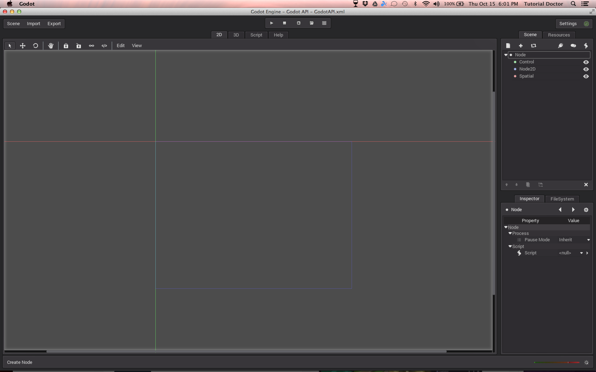

## Create a node

Everything in Godot, is an object. So naturally the **Object Class** is the super-class of all other objects in Godot. Sub-objects like buttons, images, sounds , 3d models etc. are all derived from the Object Class.

The first sub-class of the Object Class is the **Node Class**. The Node class is the base class for all elements in your scene/level. 

- To create a node in Godot, click on the ***Create Node*** button.

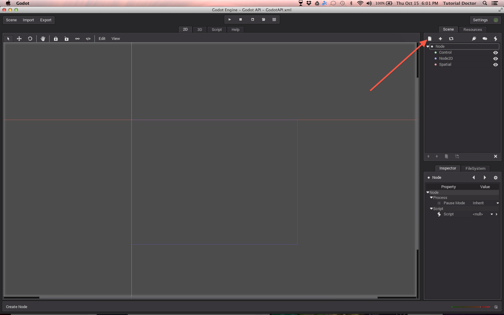

## Choose a node

The first class of the Node Class is the CanvasItem Class. This class is the base class for all 2D Godot objects. Every Godot scene/level must have a root node. (and it can't be saved without one). There are three main types of root nodes in Godot.

- Control
	- **Control** nodes are for graphical user interfaces **(GUI)s** and can be used to make **game menus**. You can identify them by their **green** color.
	
- Node2D
	- **Node2D** nodes are for **2D games**. All 2D game objects are made with these nodes. You can identify them by their **blue** color.

- Spatial
	- **Spatial** nodes are for **3D games**. All 3D game objects are made with these nodes. You can identify them by their **pink** color.  

Control and Node2D nodes are sub-classes of the **CanvasItem Class**. The Spatial nodes are directly sub-classes of the Node Class.One more node class to make note of is the **CanvasLayer Class**. We will not discuss this in this brief tutorial.To create a node, select it and then click ***Create***."

- Create a "Node" node (it's grey).

The first node in any Godot scene will be the **root**/main node of the scene. All other nodes will be "**children**" of this "**parent**" node. To **create a child** of a node, **select the  node** and add create a new node.

- Create three children nodes for the "Node" node. Create a Control, Node2D, and Spatial node.

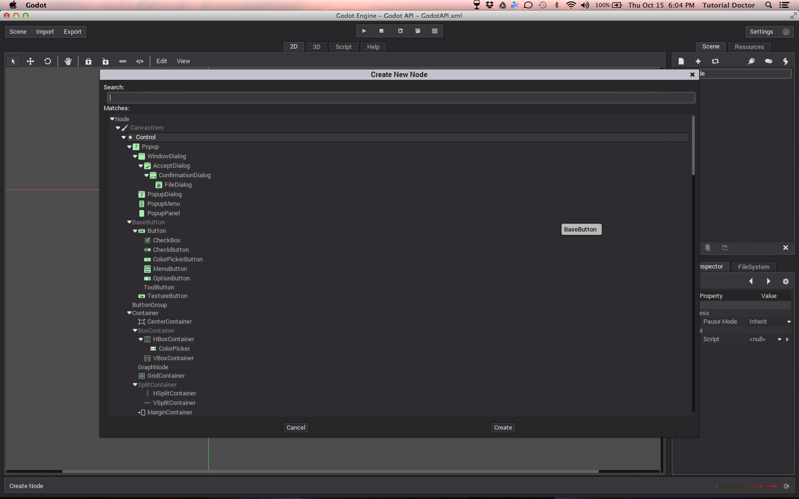

You can now add GUI elements, 2D game elements, and 3D elements to to their respective root nodes. As a note, these three root nodes do not *have* to be the root nodes, but it is best practice to make them so.

## Add a script
These nodes are useless if they cannot do anything. They need a brain! The brain of a node in Godot is the script! To add a ~~brain~~ script to a node, **select the node** and click the ***Create Node Script"*** button.

- Add a script to the "Node" node.

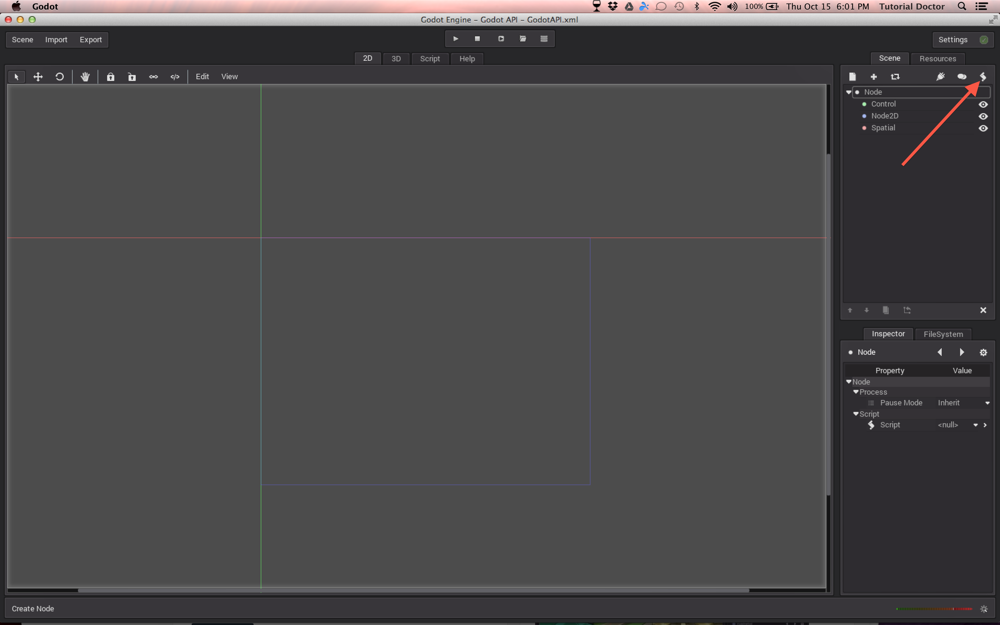

## Save the script

You can save the script to a location in your project folder with the **.gd** extension. Click ***Create*** to create the script of the current node.

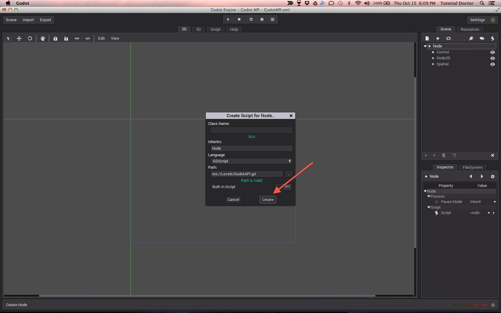

## The Code Editor

Once your script is created, the code editor pops up. This is where you give your node a brain. *If I~~t~~ only had a ~~brain~~ script....*

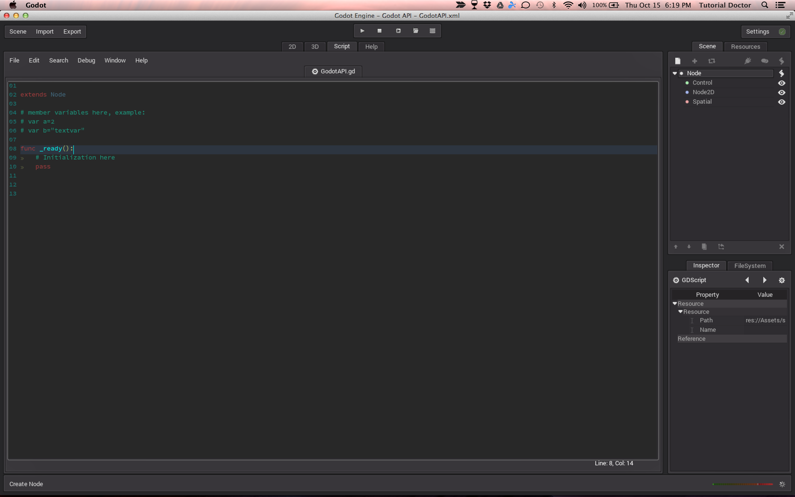

## Help

By default, every node comes with some of their own functions/methods. To get help on what functions a node has, **select the name** of the node where it says "extends", click ***Help***, and navigate to ***Contextual***.

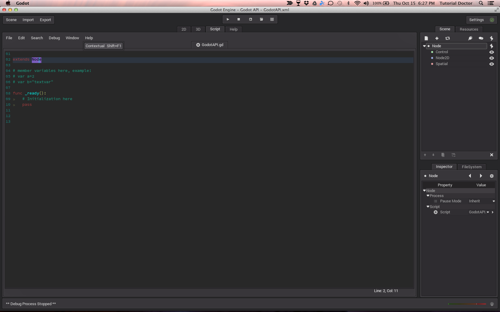

## API

** AND HERE IT IS!** The Godot **API**(Application Programming Interface)!

This is where you get the functions, variables and classes you need to interface with (talk to) Godot! At the top you will see the **name** of the current Node/Class, the **super-class** of that node (the one whose traits it inherits), and a brief **description** of what the class is. Beneath that you will see all of the **methods** that the class has. You will see **signals** for event handling and **constants**. Remember that functions are instructions and are like verbs, and verbs are action words!So, what actions/methods does the Node class have?

- That get_children() method/instruction looks cool!

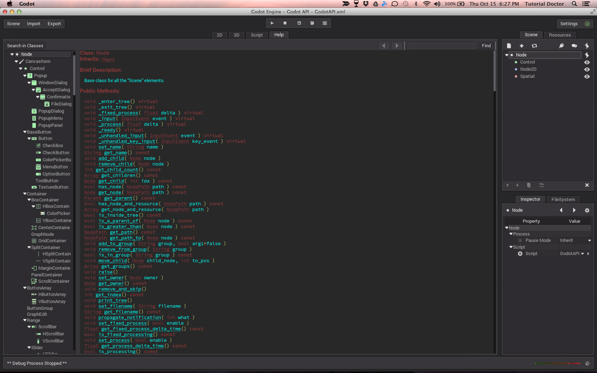

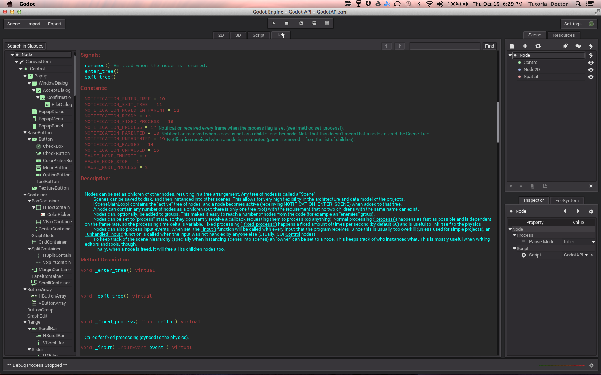

## Using a method

- Go back to your script by clicking on the ***Script*** tab.

Let's print that get_children() function to print the children of this Node. The print() function is your friend!

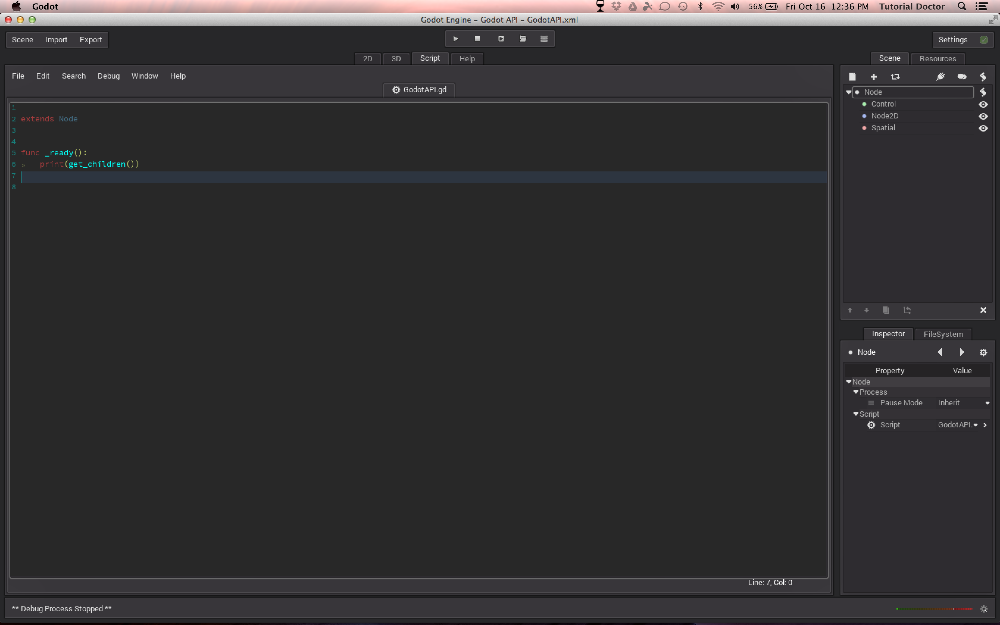

- Click the ***Play*** button to run the game

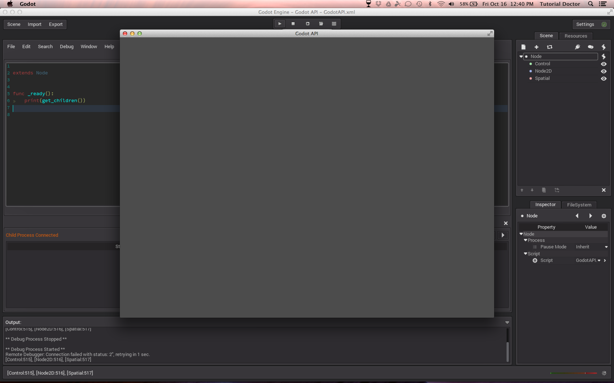

The game runs and the children of the "Node" node are printed to the console.Looking back at the API to the **left** of the method name, in **red** we see that this method **returns** an **Array**. This method takes no arguments (there are no values inside of the parenthesis).
ct 
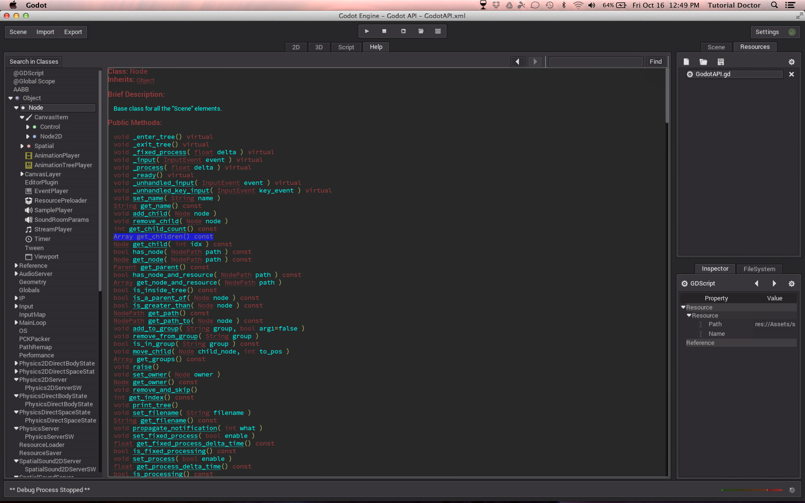

We can even add some basic logic to print the names of the children using the get_names() method on each child:

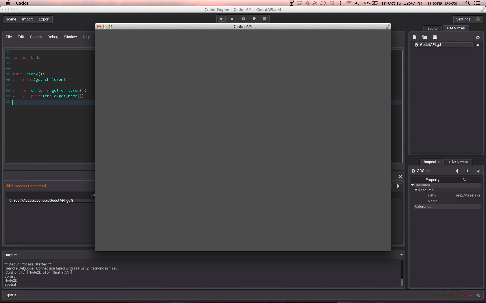

Since the Node Class is a sub-class of the Object Class, it inherits all traits of the Object Class, and thus it can use all methods, signals, and constants of the Object Class.

- ~~[Link to Godot syntax]()~~
- ~~[Link to Godot Process]()~~
